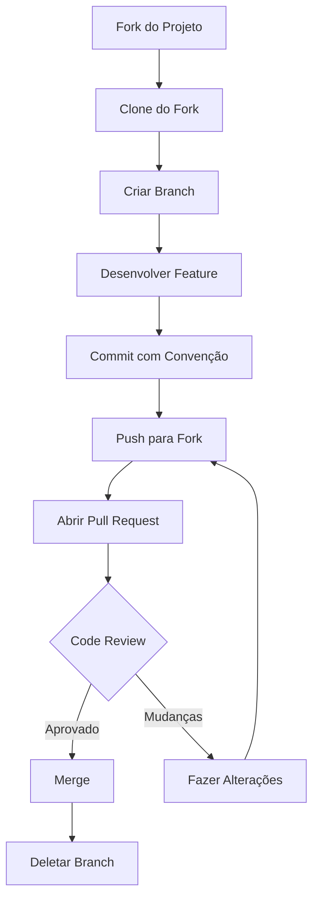

# Contribuição

Este guia descreve como contribuir com o desenvolvimento da Fastcar API.

## 🤝 Como Contribuir

Contribuições são bem-vindas! Existem várias formas de contribuir:

- 🐛 Reportar bugs
- 💡 Sugerir novas funcionalidades
- 📝 Melhorar documentação
- 🔧 Enviar correções e features
- 🧪 Escrever testes
- 🔍 Revisar código

## 📋 Código de Conduta

### Nossos Padrões

- Seja respeitoso e inclusivo
- Aceite críticas construtivas
- Foque no que é melhor para a comunidade
- Demonstre empatia

### Comportamentos Inaceitáveis

- Uso de linguagem ou imagens sexuais
- Trolling, comentários insultuosos
- Assédio público ou privado
- Publicar informações privadas de outros

## 🚀 Começando

### 1. Fork o Projeto

```bash
# No GitHub, clique em "Fork"
# Ou via CLI
gh repo fork <url-do-repositorio>
```

### 2. Clone Seu Fork

```bash
git clone https://github.com/SEU-USUARIO/car_api.git
cd car_api
```

### 3. Configure Upstream

```bash
# Adicionar repositório original como upstream
git remote add upstream https://github.com/ORIGINAL-USUARIO/car_api.git

# Verificar remotes
git remote -v
```

### 4. Crie uma Branch

```bash
# Sempre crie uma branch para sua feature/fix
git checkout -b feature/minha-feature
# ou
git checkout -b fix/correcao-bug
# ou
git checkout -b docs/atualizacao-docs
```

## 📝 Tipos de Contribuição

### 🐛 Reportando Bugs

Ao reportar bugs, inclua:

- **Título descritivo**: Ex: "Erro 500 ao criar usuário com email duplicado"
- **Descrição detalhada**: O que aconteceu vs. o que esperava
- **Passos para reproduzir**:
  ```
  1. Executar endpoint POST /api/v1/users/
  2. Enviar JSON com email duplicado
  3. Observar erro 500
  ```
- **Ambiente**: Python version, OS, etc.
- **Logs**: Stack traces relevantes

### 💡 Sugerindo Features

Ao sugerir features, inclua:

- **Descrição**: O que a feature faz
- **Caso de uso**: Por que é necessária
- **Exemplos**: Como seria usada
- **Alternativas**: Workarounds atuais

### 🔧 Enviando Código

#### Antes de Enviar

```bash
# 1. Atualize sua branch
git fetch upstream
git rebase upstream/main

# 2. Instale dependências
poetry install --with dev

# 3. Rode linting
poetry run task lint

# 4. Formate o código
poetry run task format

# 5. Rode testes
poetry run pytest tests/

# 6. Verifique coverage
poetry run pytest tests/ --cov=car_api
```

#### Padrões de Commit

Use [Conventional Commits](https://www.conventionalcommits.org/):

```
feat: adicionar nova funcionalidade
fix: corrigir bug
docs: atualizar documentação
style: formatar código
refactor: refatorar código
test: adicionar testes
chore: atualizar configurações
```

**Exemplos:**

```bash
git commit -m "feat: adicionar filtro de preço na listagem de carros"
git commit -m "fix: corrigir validação de placa no schema CarSchema"
git commit -m "docs: atualizar README com instruções de instalação"
git commit -m "test: adicionar testes para endpoint de autenticação"
```

#### Pull Request

1. **Título descritivo**
   ```
   feat: adicionar filtro de preço na listagem de carros
   ```

2. **Descrição do PR**
   ```markdown
   ## Descrição
   Adiciona filtros de preço mínimo e máximo no endpoint de listagem de carros.

   ## Mudanças
   - Adicionado parâmetros min_price e max_price no endpoint GET /cars/
   - Adicionado validação nos schemas
   - Adicionado testes

   ## Issue relacionada
   Fixes #123

   ## Checklist
   - [ ] Testes adicionados
   - [ ] Documentação atualizada
   - [ ] Linting passando
   ```

3. **Review**
   - Aguarde review dos mantenedores
   - Responda feedbacks
   - Faça alterações se necessário

## 📐 Guidelines de Código

### Estilo de Código

Siga as guidelines em [guidelines.md](guidelines.md):

- Line length: 79 caracteres
- Quotes: aspas simples
- Type hints: sempre usar
- Docstrings: em funções públicas

### Estrutura de Código

```python
# ✅ Correto
from typing import Optional
from fastapi import APIRouter, Depends

from car_api.core.database import get_session
from car_api.models.users import User


router = APIRouter()


@router.get('/exemplo')
async def get_exemplo(
    user_id: int,
    db: AsyncSession = Depends(get_session),
) -> Optional[User]:
    """
    Buscar usuário por ID.
    
    Args:
        user_id: ID do usuário
        db: Sessão do banco de dados
    
    Returns:
        Usuário encontrado ou None
    """
    return await db.get(User, user_id)
```

### Testes

```python
# ✅ Correto
def test_create_user_success(client: TestClient):
    """Testar criação de usuário com sucesso."""
    response = client.post(
        '/api/v1/users/',
        json={'username': 'test', 'email': 'test@test.com', 'password': '123456'}
    )
    assert response.status_code == 201
```

## 🔍 Processo de Review

### O que os Mantenedores Avaliam

- [ ] Código segue guidelines
- [ ] Testes adicionados/atualizados
- [ ] Documentação atualizada
- [ ] Não quebra funcionalidades existentes
- [ ] Commits seguem convenção
- [ ] Código é legível e manutenível

### Tempo de Resposta

- PRs de bugs críticos: 24-48 horas
- PRs de features: 3-7 dias
- PRs de documentação: 1-3 dias

## 📊 Áreas que Precisam de Ajuda

### Prioridade Alta

- [ ] Aumentar coverage de testes
- [ ] Melhorar documentação de endpoints
- [ ] Adicionar mais validações

### Prioridade Média

- [ ] Implementar cache
- [ ] Adicionar paginação avançada
- [ ] Melhorar mensagens de erro

### Prioridade Baixa

- [ ] Adicionar GraphQL
- [ ] Implementar WebSocket
- [ ] Adicionar suporte a múltiplos bancos

## 🏆 Reconhecimento

Contribuidores são reconhecidos em:

- README.md
- Release notes
- Documentação

## 📞 Comunicação

### Canais

- **Issues**: Bugs e features
- **Discussions**: Dúvidas e ideias
- **Email**: Contato direto com mantenedores

### Boas Práticas

- Seja claro e objetivo
- Forneça contexto
- Seja paciente
- Agradeça ajuda

## 📝 Template de Issue

### Bug Report

```markdown
**Descrição**
Uma descrição clara do bug.

**Para Reproduzir**
Passos para reproduzir:
1. Ir para '...'
2. Clicar em '...'
3. Ver erro

**Comportamento Esperado**
O que deveria acontecer.

**Screenshots**
Se aplicável.

**Ambiente**
- OS: [ex: Ubuntu 22.04]
- Python: [ex: 3.13]
- Versão: [ex: 0.1.0]

**Contexto Adicional**
Qualquer outro contexto.
```

### Feature Request

```markdown
**Problema Relacionado**
O problema que a feature resolve.

**Solução Proposta**
Como a feature funcionaria.

**Alternativas Consideradas**
Outras soluções pensadas.

**Contexto Adicional**
Qualquer outro contexto.
```

## 🚀 Workflow de Contribuição



## 📚 Recursos

### Documentação

- [FastAPI](https://fastapi.tiangolo.com/)
- [SQLAlchemy](https://docs.sqlalchemy.org/)
- [Pydantic](https://docs.pydantic.dev/)
- [Poetry](https://python-poetry.org/docs/)

### Guias

- [Conventional Commits](https://www.conventionalcommits.org/)
- [GitHub Flow](https://guides.github.com/introduction/flow/)
- [Code Review Guide](https://google.github.io/eng-practices/)

## 🙏 Obrigado

Agradecemos todas as contribuições! Cada PR, issue e discussão ajuda a melhorar o projeto.

---

**Dúvidas?** Abra uma [Discussion](https://github.com/usuario/car_api/discussions) ou issue.

Próxima seção: [Release Notes](release-notes.md)
