# Modelagem do Sistema

Este documento apresenta a modelagem completa do sistema, incluindo modelos de dados, arquitetura e fluxos principais.

## 📊 Modelos de Dados (ERD)

### Diagrama Entidade-Relacionamento

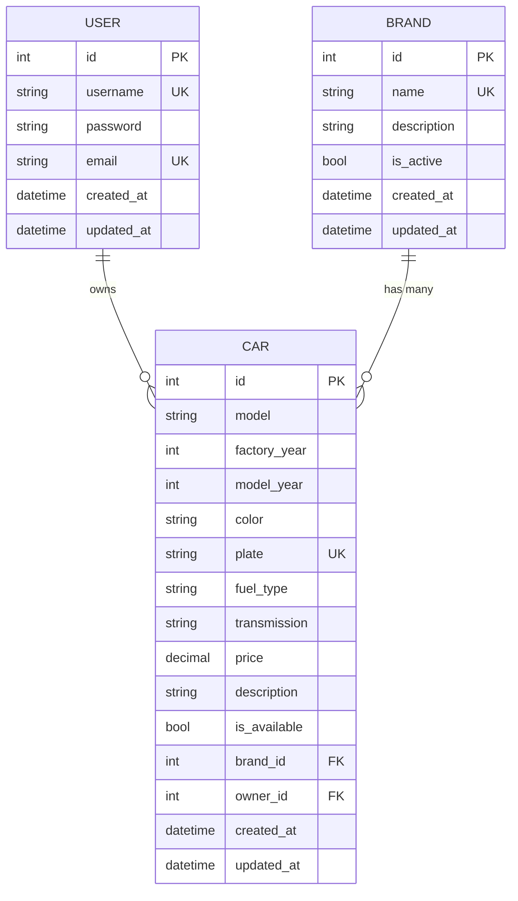

### Detalhes dos Modelos

#### User (Usuário)

| Campo | Tipo | Restrições | Descrição |
|-------|------|------------|-----------|
| `id` | int | PRIMARY KEY, AUTO INCREMENT | Identificador único |
| `username` | string(50) | UNIQUE, NOT NULL | Nome de usuário |
| `password` | string | NOT NULL | Senha com hash (Argon2) |
| `email` | string(100) | UNIQUE, NOT NULL | Email do usuário |
| `created_at` | datetime | DEFAULT NOW() | Data de criação |
| `updated_at` | datetime | DEFAULT NOW(), ON UPDATE | Data de atualização |

#### Brand (Marca)

| Campo | Tipo | Restrições | Descrição |
|-------|------|------------|-----------|
| `id` | int | PRIMARY KEY, AUTO INCREMENT | Identificador único |
| `name` | string(50) | UNIQUE, NOT NULL | Nome da marca |
| `description` | text | NULLABLE | Descrição da marca |
| `is_active` | bool | DEFAULT TRUE | Status da marca |
| `created_at` | datetime | DEFAULT NOW() | Data de criação |
| `updated_at` | datetime | DEFAULT NOW(), ON UPDATE | Data de atualização |

#### Car (Carro)

| Campo | Tipo | Restrições | Descrição |
|-------|------|------------|-----------|
| `id` | int | PRIMARY KEY, AUTO INCREMENT | Identificador único |
| `model` | string(100) | NOT NULL | Modelo do veículo |
| `factory_year` | int | NOT NULL | Ano de fabricação |
| `model_year` | int | NOT NULL | Ano modelo |
| `color` | string(30) | NOT NULL | Cor do veículo |
| `plate` | string(10) | UNIQUE, INDEX | Placa do veículo |
| `fuel_type` | enum | NOT NULL | Tipo de combustível |
| `transmission` | enum | NOT NULL | Tipo de transmissão |
| `price` | decimal(10,2) | NOT NULL | Preço do veículo |
| `description` | text | NULLABLE | Descrição detalhada |
| `is_available` | bool | DEFAULT TRUE | Disponibilidade |
| `brand_id` | int | FOREIGN KEY → Brand.id | Marca do veículo |
| `owner_id` | int | FOREIGN KEY → User.id | Proprietário |
| `created_at` | datetime | DEFAULT NOW() | Data de criação |
| `updated_at` | datetime | DEFAULT NOW(), ON UPDATE | Data de atualização |

### Enums

#### FuelType (Tipo de Combustível)

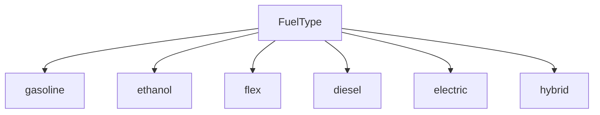

#### TransmissionType (Tipo de Transmissão)

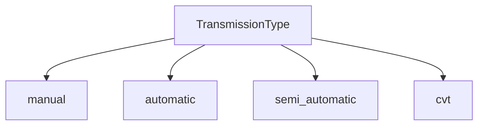

### Relacionamentos

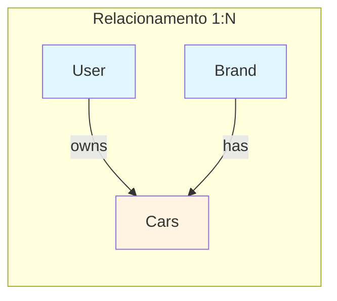

## 🏗️ Arquitetura do Sistema

### Visão Geral da Arquitetura

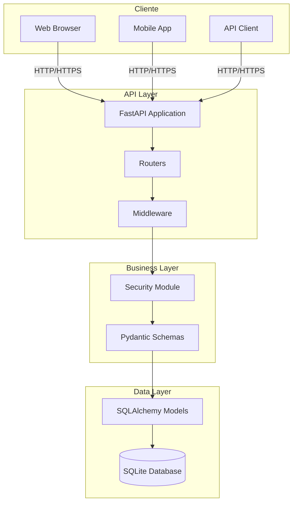

### Arquitetura em Camadas

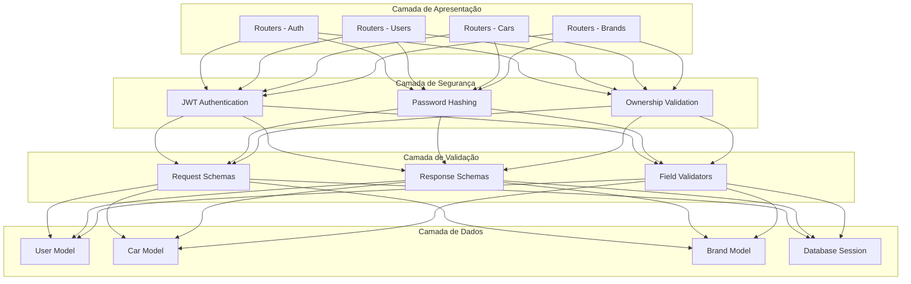

### Fluxo de Requisição

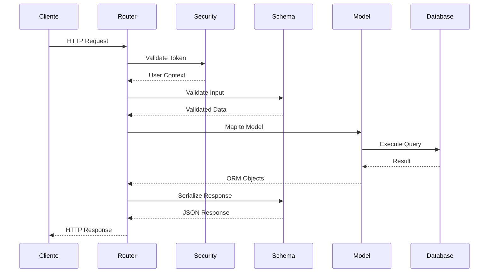

## 🔐 Fluxo de Autenticação

### Login e Geração de Token

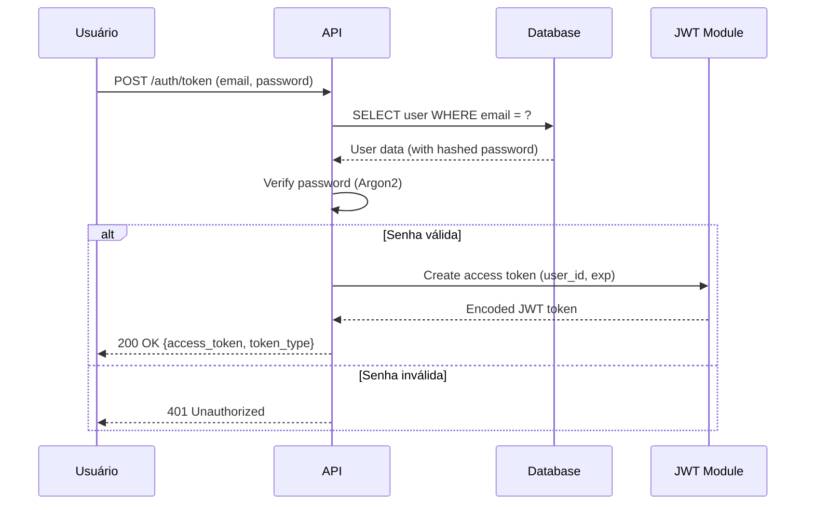

### Acesso a Endpoint Protegido

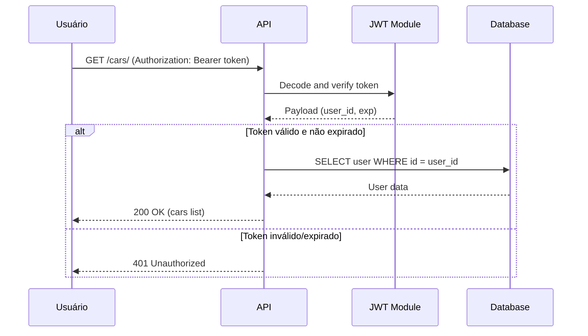

### Refresh Token

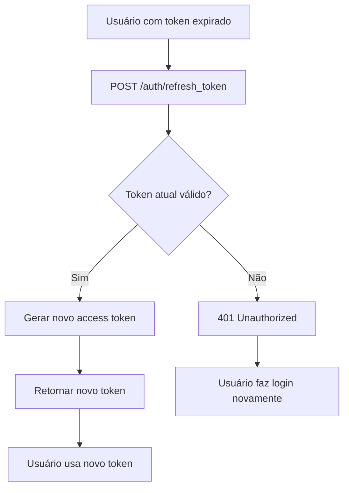

### Diagrama Completo de Autenticação

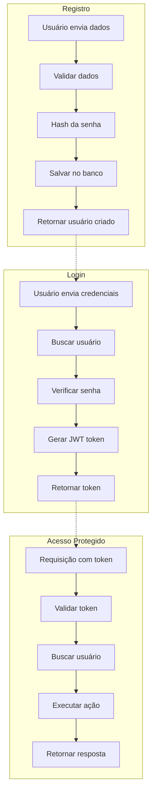

## 🚗 Fluxo CRUD de Carros

### Criar Carro

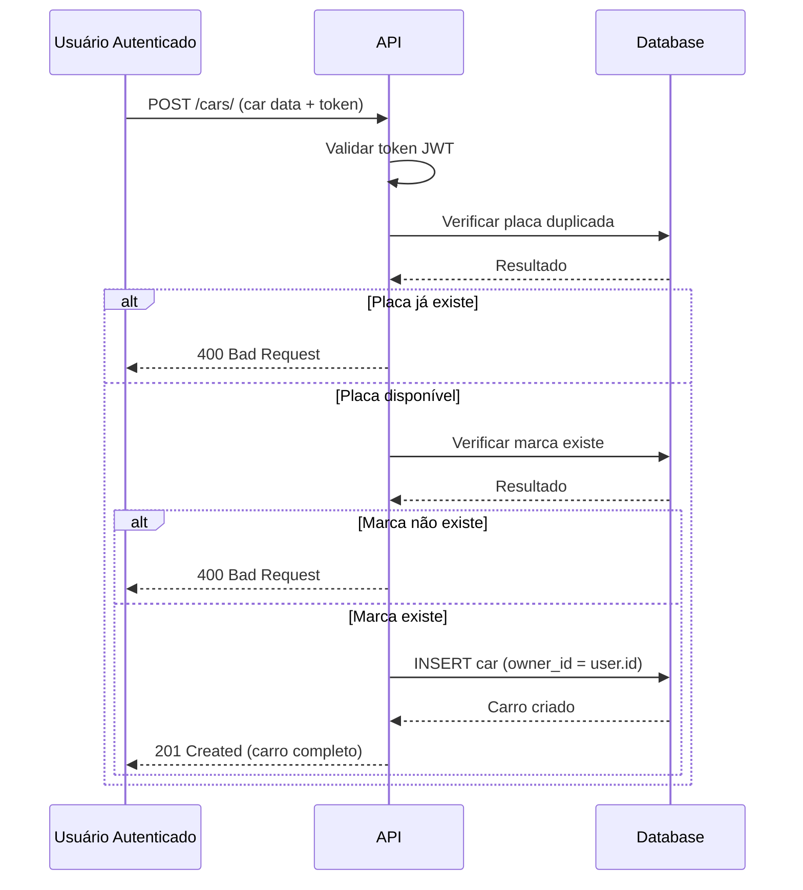

### Listar Carros

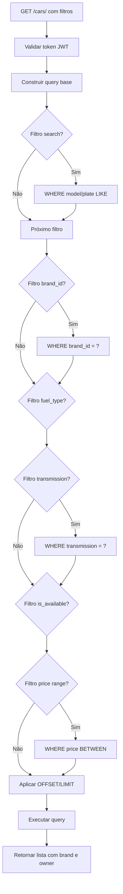

### Atualizar Carro

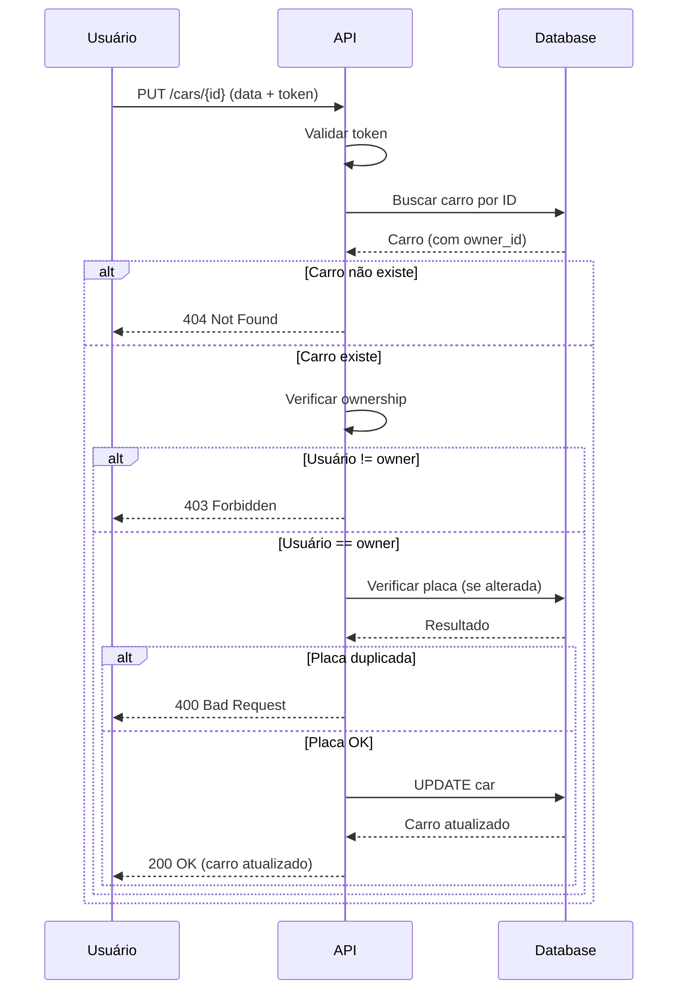

### Deletar Carro

```mermaid
flowchart TD
    A[DELETE /cars/{id}] --> B[Validar token JWT]
    B --> C[Bucar carro no banco]
    C --> D{Carro existe?}
    D -->|Não| E[404 Not Found]
    D -->|Sim| F{Usuário é owner?}
    F -->|Não| G[403 Forbidden]
    F -->|Sim| H[DELETE do banco]
    H --> I[Commit transação]
    I --> J[204 No Content]
```

### Fluxo Completo CRUD

```mermaid
flowchart LR
    subgraph "CRUD Carros"
        C[Create] -->|POST /cars/| C1[Validar dados<br/>Verificar placa<br/>Salvar]
        R[Read] -->|GET /cars/| R1[Listar com filtros<br/>GET /cars/{id}<br/>Buscar por ID]
        U[Update] -->|PUT /cars/{id}| U1[Verificar ownership<br/>Validar dados<br/>Atualizar]
        D[Delete] -->|DELETE /cars/{id}| D1[Verificar ownership<br/>Remover]
    end
    
    style C fill:#e8f5e9
    style R fill:#e3f2fd
    style U fill:#fff3e0
    style D fill:#ffebee
```

## 🔒 Fluxo de Segurança

### Hash de Senha

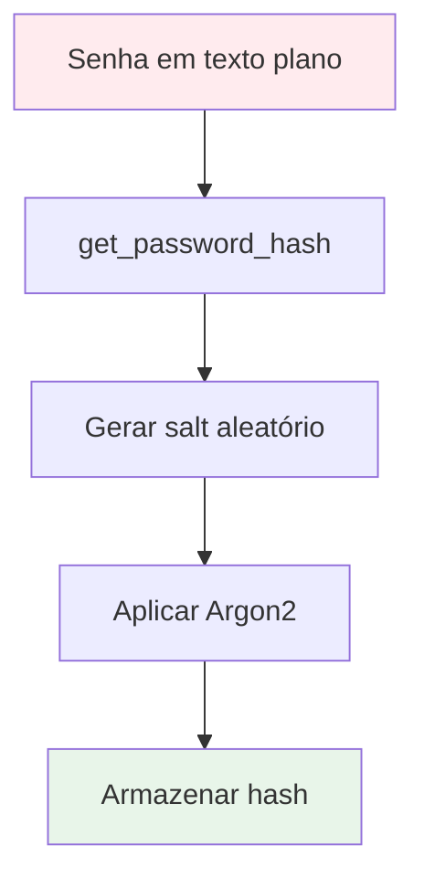

### Verificação de Senha

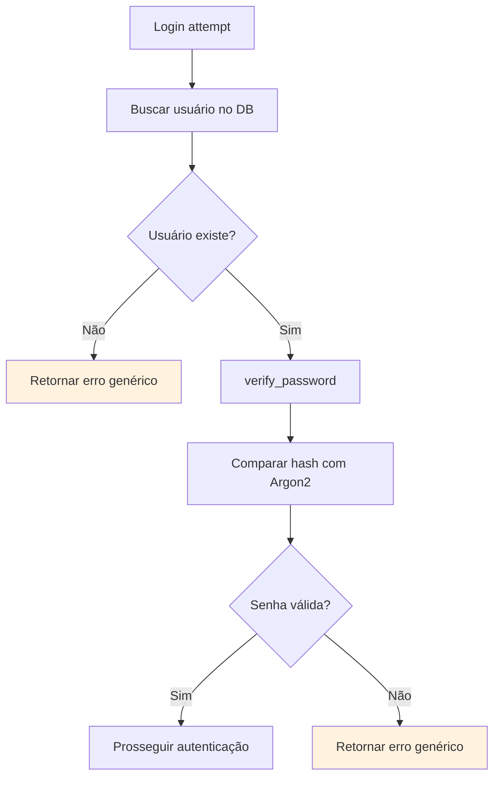

### Validação de Ownership

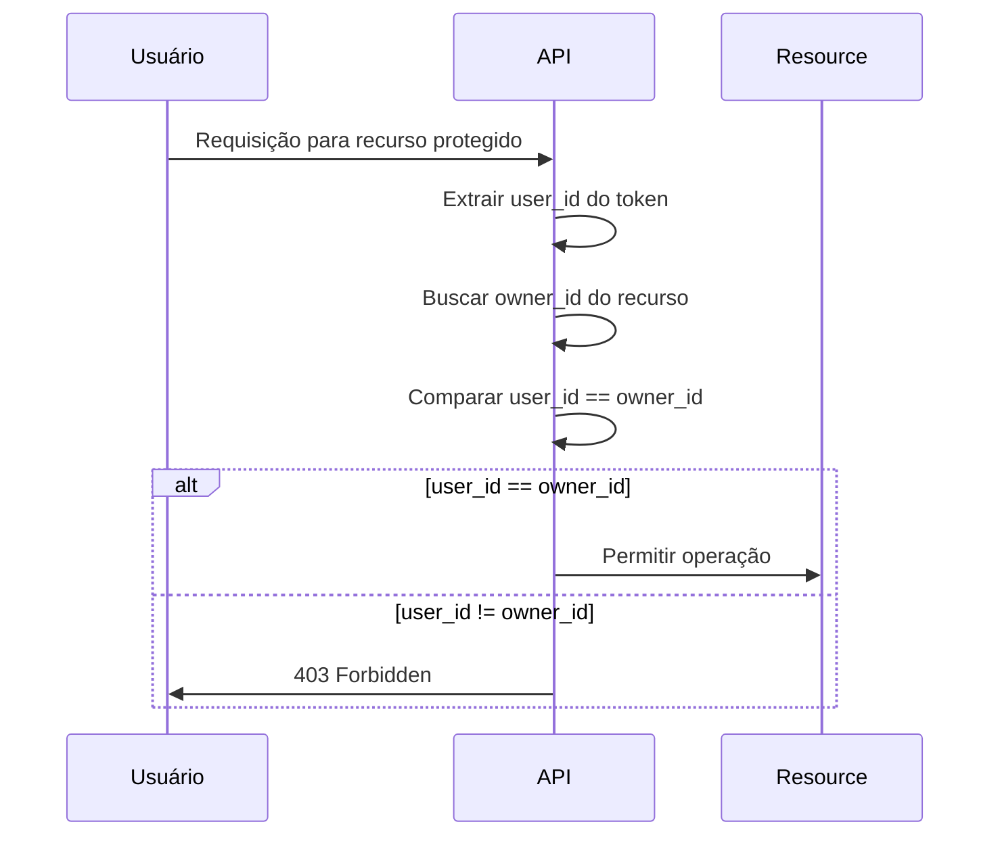

### Ciclo de Vida do Token JWT

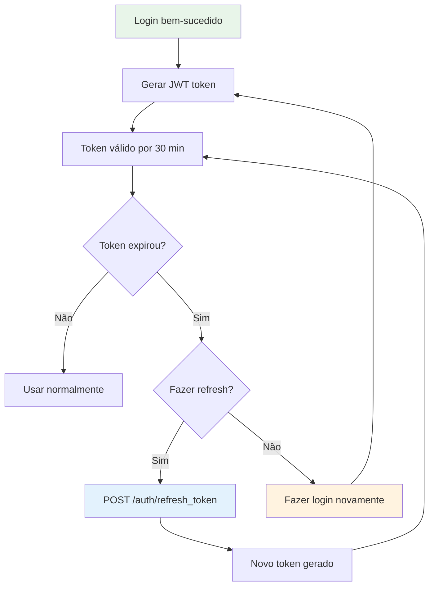

### Matriz de Segurança

```mermaid
flowchart TB
    subgraph "Camadas de Segurança"
        A1[HTTPS/TLS] --> A2[JWT Authentication]
        A2 --> A3[Password Hashing Argon2]
        A3 --> A4[Ownership Validation]
        A4 --> A5[Input Validation]
        A5 --> A6[SQL Injection Prevention]
    end
    
    subgraph "Proteções"
        B1[Rate Limiting]
        B2[CORS Policy]
        B3[Error Handling]
        B4[Logging Seguro]
    end
    
    A6 --> B1 & B2 & B3 & B4
```

## 📈 Escalabilidade

### Arquitetura para Escala

```mermaid
flowchart TB
    subgraph "Load Balancer"
        LB[NGINX / HAProxy]
    end
    
    subgraph "API Instances"
        API1[FastAPI Instance 1]
        API2[FastAPI Instance 2]
        API3[FastAPI Instance 3]
    end
    
    subgraph "Database"
        DB[(PostgreSQL Cluster)]
    end
    
    subgraph "Cache"
        CACHE[(Redis)]
    end
    
    LB --> API1 & API2 & API3
    API1 & API2 & API3 --> DB
    API1 & API2 & API3 --> CACHE
```

## 🚀 Próximo Passo

Com a modelagem compreendida, prossiga para [Autenticação e Segurança](authentication.md).

---

**Dúvidas?** Consulte [API Endpoints](api-endpoints.md) para ver como os endpoints se relacionam com os modelos.
